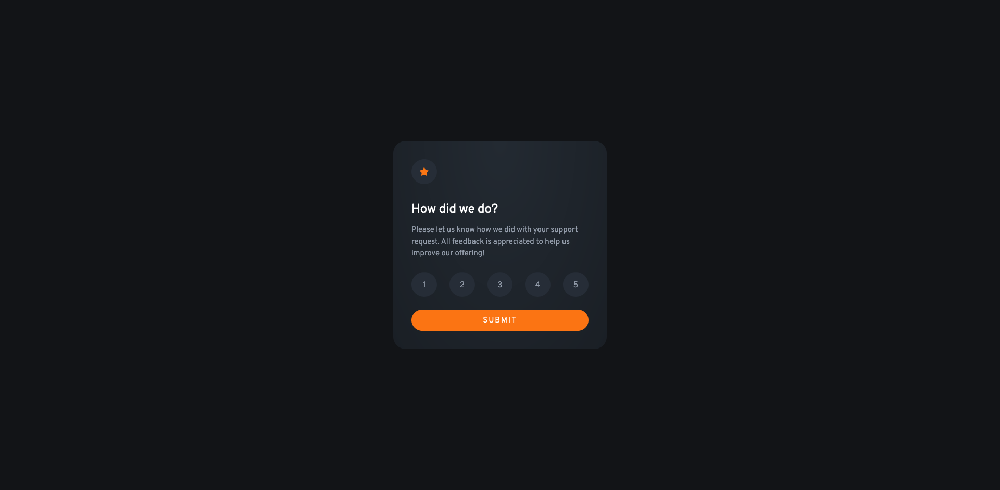

# Frontend Mentor - Interactive rating component solution

This is a solution to the [Interactive rating component challenge on Frontend Mentor](https://www.frontendmentor.io/challenges/interactive-rating-component-koxpeBUmI). Frontend Mentor challenges help you improve your coding skills by building realistic projects. 

## Table of contents

- [Overview](#overview)
  - [The challenge](#the-challenge)
  - [Screenshot](#screenshot)
  - [Links](#links)
- [My process](#my-process)
  - [Built with](#built-with)
  - [What I learned](#what-i-learned)
  - [Continued development](#continued-development)
  - [Useful resources](#useful-resources)
- [Author](#author)

**Note: Delete this note and update the table of contents based on what sections you keep.**

## Overview

### The challenge

Users should be able to:

- View the optimal layout for the app depending on their device's screen size
- See hover states for all interactive elements on the page
- Select and submit a number rating
- See the "Thank you" card state after submitting a rating

### Screenshot

### Links

- Solution URL: [URL here](https://www.frontendmentor.io/solutions/ratin-component-with-vanilla-js-KZTf4koSDX)
- Live Site URL: [URL here](https://akajfes-js-rating.netlify.app)

## My process

### Built with

- Semantic HTML5 markup
- CSS
- Flexbox
- Vanilla JS

**Note: These are just examples. Delete this note and replace the list above with your own choices**

### What I learned

For the CSS, I have used a radial gradient from the top for the first time. It was also my first time using the transform: translate property to center the component. I also was able to learn the difference between the hover and active states for the first time.

For JavaScript, moreso than learning anything new, this was my first solo JavaScript project that wasn't done for school. I had no assistance from a teacher or instructions for a project, so this was a good confidence builder for me. 

### Continued development

I still need extra practice with JS in terms of using for loops and making things more minimal. 

### Useful resources

- [CSS gradient resource](https://www.quirksmode.org/css/images/position.html) - This helped me with the radial gradient positioning.
- [JavaScript resource](https://dev.to/nicm42/multiple-buttons-looking-like-theyre-staying-pressed-one-at-a-time-4bbb) - This helped me do the code to have the buttons have an active state of sorts, and reset the other buttons that were pressed.

## Author
- Frontend Mentor - [@yourusername](https://www.frontendmentor.io/profile/yourusername)
- GitHub - [@akajfes](https://github.com/akajfes)